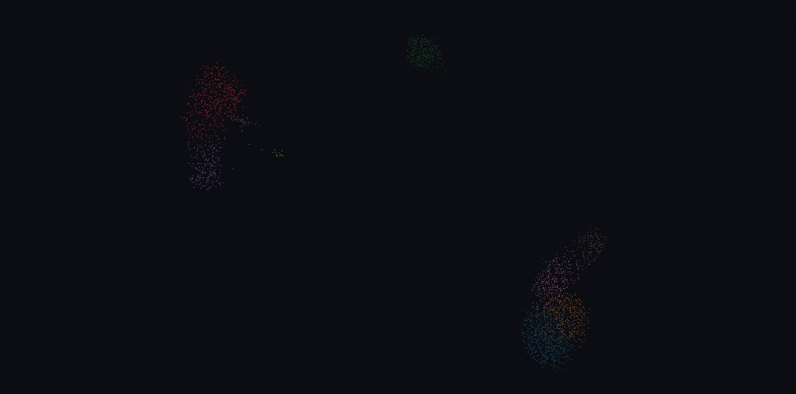

# pointcloud-atlas

A dataset-agnostic **WebGL point-cloud visualizer** (deck.gl) for embeddings of any
corpus. Point it at a packed buffer set + a `config` block and you get a colored,
filterable, lasso-selectable scatter with 2D/3D projections — no build step for the
viewer. The entire UI (title, color-by attributes, palettes, legend, projections,
hover fields) is declared in data, so a new dataset is a *config*, not a fork.



## Why

Plotting tools choke past ~10⁴ points; this renders 10⁴–10⁶+ as binary buffers
streamed straight into GPU typed arrays. One engine serves many projects: each is
just its own buffer set.

## Quick start

```bash
# build the bundled single-cell example (PBMC 3k) — needs scanpy/anndata
python3 examples/singlecell/build.py
# serve engine + that example's data
python3 serve.py examples/singlecell 8770
# open http://127.0.0.1:8770/
```

Color by a categorical attribute (clusters) or a continuous one (a gene's expression);
toggle UMAP/t-SNE in 2D/3D; lasso-select.

## Use it for your own data

```python
from packer.pack import Attribute, pack_atlas
pack_atlas(
    "mydata/",
    ids=my_ids,                                   # one label per point
    embeddings_2d={"umap": xy, "tsne": xy2},      # (N,2) arrays
    embeddings_3d={"umap": xyz},                  # (N,3) arrays
    attributes=[
        Attribute("group", "group", "categorical", group_labels),
        Attribute("score", "score", "continuous",  scores, colormap="viridis"),
    ],
    title="My atlas", node_label="items",
)
```

Then serve `engine/index.html` with the buffer dir at `/data/`. The engine reads
`manifest.json`'s `config` block and builds the UI.

## Layout

| Path | What |
|---|---|
| `engine/index.html` | The viewer (self-contained; deck.gl from CDN). The maintained artifact. |
| `engine/_generalize.js` | The config-driven layer (color/legend/hover/labels/dropdowns) embedded in the viewer. |
| `packer/pack.py` | Generic packer: arrays + `Attribute`s → buffers + `manifest.json`. |
| `examples/singlecell/` | PBMC-3k example (`build.py` + packed `data/`). |
| `serve.py` | Dev server: `/` → engine, `/data/` → an example's buffers. |
| `docs/DATA_CONTRACT.md` | Binary buffer + manifest/config spec. |

## Features

All config-driven, all composing through one constraint stack (filters ∧ search ∧ lasso):

- **Color by** any categorical (palette + swatch legend) or continuous (colormap + gradient legend) attribute
- **Filter:** click legend chips to subset by category; numeric-range rail for continuous attributes
- **Search** node ids + metadata → subsets the cloud, lists clickable results
- **Lasso** select (shift-drag) → subset; composes with the rest
- **Size by** any numeric attribute (Display panel); live dot-size / alpha controls
- **Projections:** UMAP/t-SNE/PaCMAP/Consensus in 2D & 3D (dropdown shows only what's present)
- **Hover card:** id + configured metadata, optional source thumbnail + link-out (`thumb_template` / `link_template`)
- Shareable URL state (camera, search, lasso); reset view

Roadmap: optional `feature_endpoint` for lazy per-feature continuous columns at huge scale; a light theme.

## Credit

The rendering core is generalized from a WebGL document-atlas the author built for a
separate project; this repo contains only generic, corpus-free code.

## License

MIT — see [LICENSE](LICENSE).
