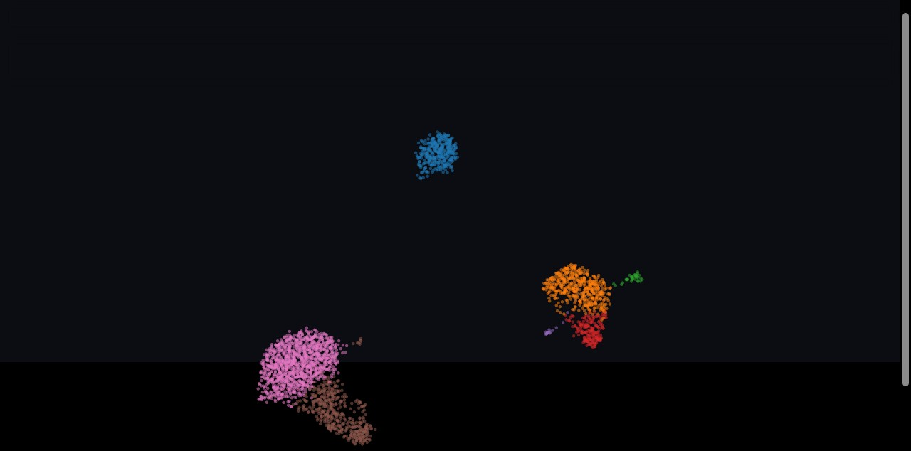
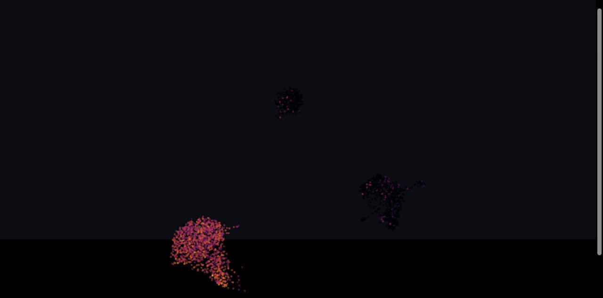
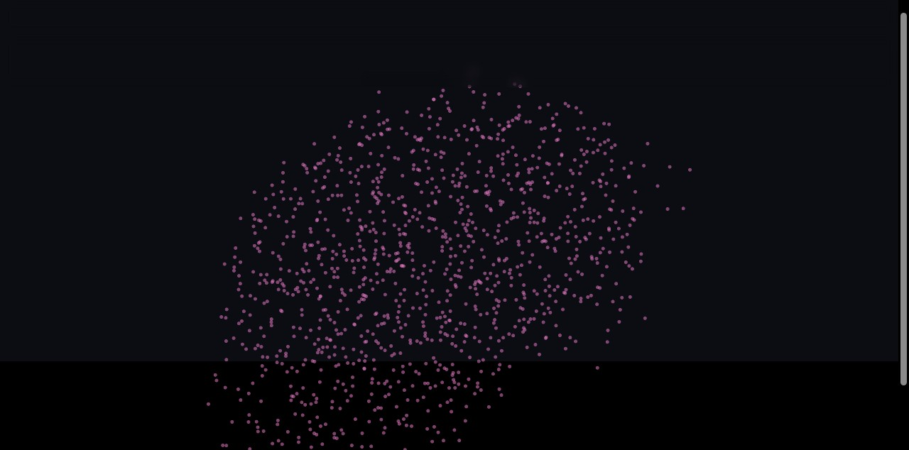
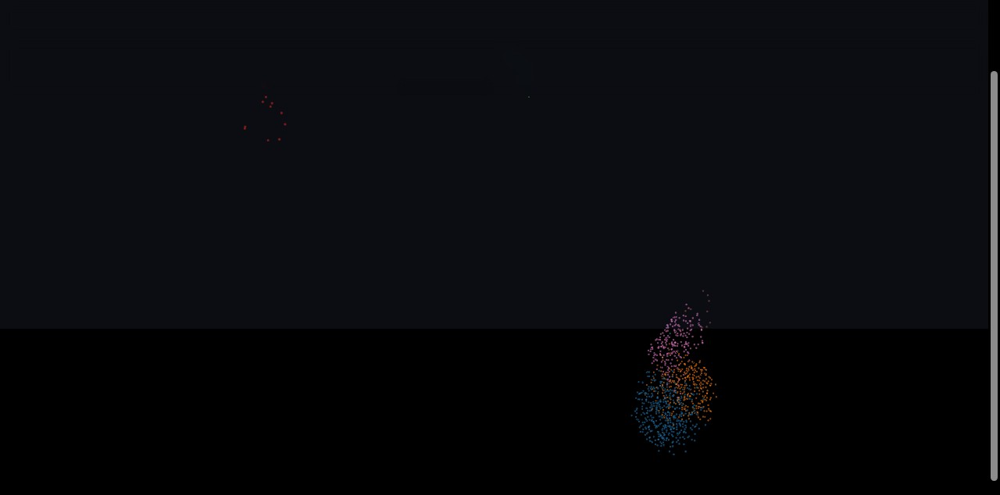
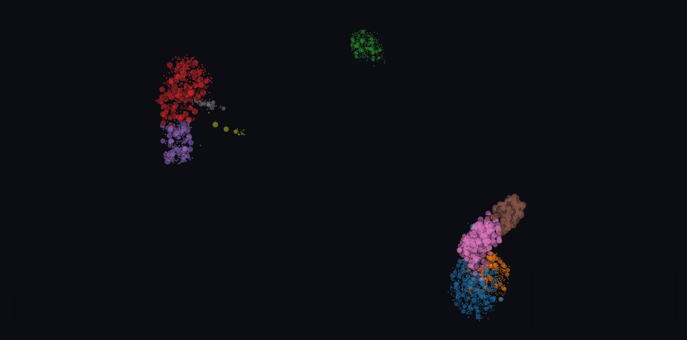
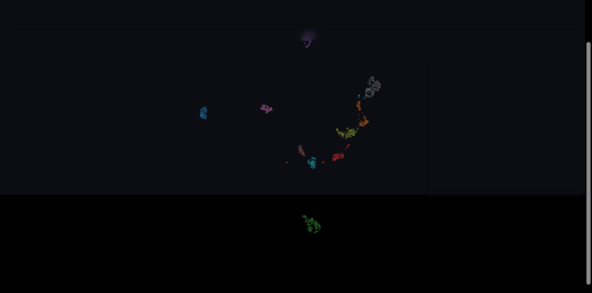

# Walkthrough

A tour of every feature, using the bundled **PBMC 3k** single-cell example
(`python3 serve.py examples/singlecell`, then open `http://127.0.0.1:8770/`).
Each point is a cell; controls live in the **top bar** (Color / View / search),
the **legend** (bottom-left), the **Display** panel (bottom-right), and the
**filter range bar** (top). The dark theme is faint in static screenshots — the
captions say which control drives each result.

> Scale note: these examples are small (2.7k / 1.8k points) so they start
> instantly. The same engine runs in production at **1,336,165 points + 2,438,403
> edges** — the binary-buffer/GPU design is what makes that work; don't switch it
> to JSON.

### 1. Color by any attribute
**Color** dropdown (top bar) → pick any attribute. Categorical attributes get a
swatch legend; here cells are colored by **cell type** (named from marker genes).

### 2. Continuous color (e.g. gene expression)
Choose a continuous attribute (a marker gene) and points are colored by a colormap
with a gradient legend. **CD3D** lights up the T-cell island — exactly where it should.

### 3. Subset by clicking the legend
Click a legend swatch to filter to that category (multi-select; click again or
**↺ clear** to reset). Here only **T cells** remain — the camera fits to them.

### 4. Numeric-range filter
The **filter range bar** (top) has a min/max box per continuous attribute. Setting
**CD3D ≥ 2** keeps only the T-cell clusters. Filters compose with everything else.

### 5. Search metadata
The **search** box (top) matches the id + categorical labels and subsets the cloud
to matches, with a clickable result list. (Shown: cells whose barcode starts `AAACG`.)

### 6. Size by a numeric attribute
**Display** panel (bottom-right) → "size by" → a continuous attribute scales each
dot. Here dots are sized by **NKG7** — NK/cytotoxic cells swell. Radius and alpha
sliders live here too.

### 7. Lasso, 3D, and link-to-source
- **Lasso:** hold **Shift** and drag to draw an ellipse and select points (composes
  with filters/search).
- **3D:** the View dropdown offers 2D and 3D for each embedding; drag to orbit.
- **Hover/source:** the hover panel shows the id + configured fields, plus an
  optional thumbnail and "open source" link. The **digits** example wires this up —
  each point shows its actual image:

All of the above are driven by the `config` block in `manifest.json` that the
packer writes — no per-dataset code. See [DATA_CONTRACT.md](DATA_CONTRACT.md).
